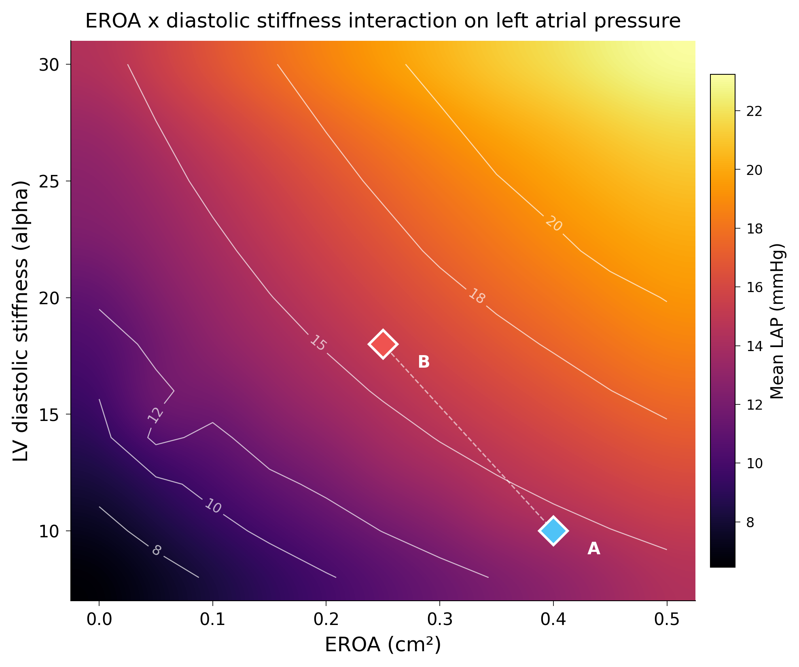
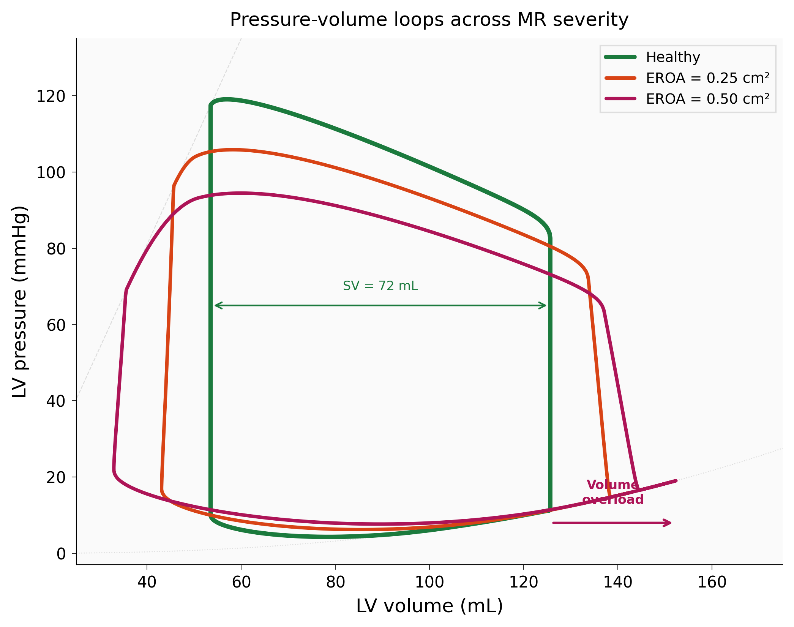
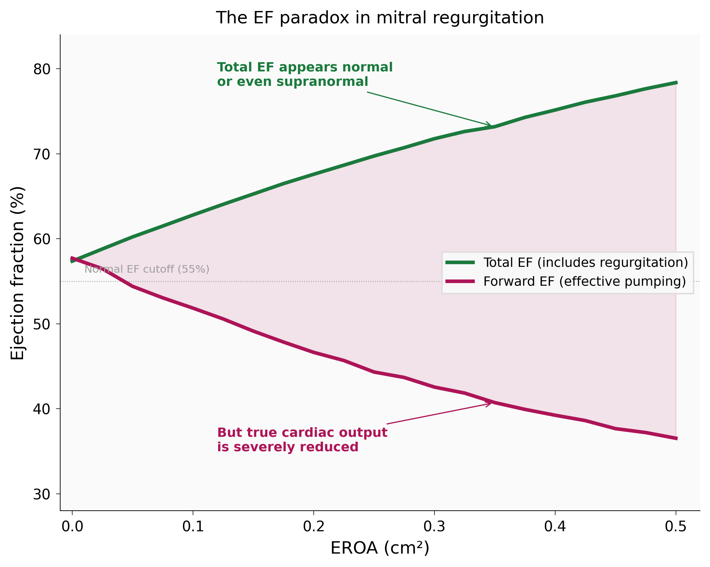
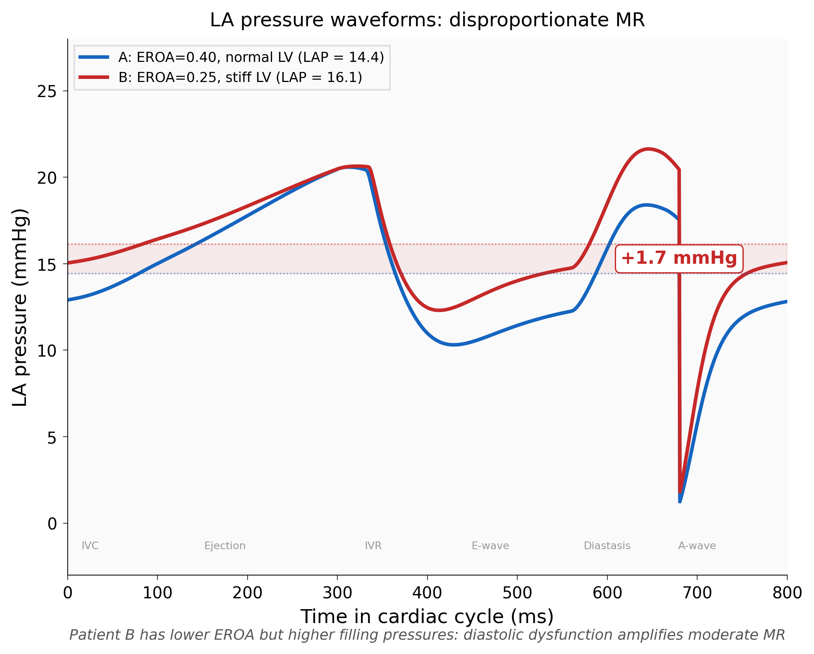

# Mitral Regurgitation Hemodynamics

[](https://github.com/GuillaumeEsclozas/mitral-regurgitation-hemodynamics/actions/workflows/ci.yml)

0D lumped-parameter cardiovascular model with digital twin layer for mitral regurgitation. Predicts LVEDP and PCWP from noninvasive echo inputs (EF, E/A, SBP) with ±2.5 mmHg accuracy under measurement noise, vs ±6 mmHg for the standard E/e' approach.



## Approach

8-compartment closed-loop ODE system (LV, LA, RV, RA, systemic/pulmonary arteries and veins) solved beat-by-beat with scipy RK45. Cardiac chambers use time-varying elastance blending active ESPVR with passive power-law EDPVR through half-sine + exponential tail activation functions. Valves are sigmoid-gated. MR is an orifice flow proportional to EROA times sqrt(P_LV minus P_LA). Volume conservation holds to machine precision. A digital twin layer inverts the forward model: differential evolution fits three parameters (LV stiffness, contractility, vascular resistance) from three noninvasive observables plus known EROA, then predicts invasive hemodynamics without catheterization.

## Results

Healthy baseline hits all 13 hemodynamic targets (EF 57.5%, BP 118/82, CO 5.40 L/min, LVEDP 11.2 mmHg, mean LAP 7.4, E/A 1.20). Volume conservation exact across all conditions.

### Pressure-volume response to MR



Progressive volume overload shifts the loop rightward. Stroke volume increases but forward output drops because an increasing fraction regurgitates into the left atrium.

### EF paradox



EROA (cm²) | Total EF | Forward EF | CO (L/min) | Mean LAP (mmHg)
:---:|:---:|:---:|:---:|:---:
0.00 | 57.5% | 57.5% | 5.40 | 7.4
0.20 | 67.7% | 46.4% | 4.84 | 11.0
0.40 | 75.4% | 39.3% | 4.38 | 14.1

Total EF rises because the LV ejects into two outlets. Forward EF, the part that actually perfuses organs, drops steadily.

### Disproportionate MR



 | Patient A (EROA=0.4, normal) | Patient B (EROA=0.25, stiff)
:---|:---:|:---:
Forward EF | 39.3% | 43.4%
LVEDP | 17.8 mmHg | **21.5 mmHg**
Mean LAP | 14.1 mmHg | **16.1 mmHg**
PCWP | 14.1 mmHg | **16.1 mmHg**

Patient B has lower EROA but higher filling pressures everywhere. Diastolic dysfunction amplifies moderate MR (Grayburn et al. 2019).

### Digital twin under noise

EF ±3%, E/A ±15% relative, SBP ±5 mmHg. 80 fits, 100% convergence.

Index | Worst-case error | vs clinical
:---|:---:|:---:
LVEDP | ±3.0 mmHg | catheter only
LAP / PCWP | ±2.5 mmHg | E/e': ±6 mmHg
CO | ±0.57 L/min | thermodilution
PAP | ±1.8 mmHg | catheter only

Jacobian condition number 5 to 7 (identifiable). Robust to ±40% EROA error (LAP shift: 0.4 mmHg). Robust to 20% mismatch in fixed parameters (LAP shift: 0.04 mmHg). Cross-validation shows E/A is the indispensable observable: dropping it degrades LVEDP predictions by 3 to 9 mmHg, dropping SBP changes nothing.

## What Worked (and What Didn't)

**Helped:** Power-law EDPVR (exponential blows up at MR volumes: 162,000 mmHg at V=180 mL), simple sigmoid valve (composite model gave -2000 mL/s when closed without inertance), RK45 over Radau (2.5x faster, sigmoid smoothing removed stiffness), per-chamber V_ref (LA volumes were 77 to 147 mL with shared V_ref, 21 to 69 mL after fix), activation-based E/A extraction (trough method fails when waves fuse above tau=40 ms), frozen dataclass with `args=` pattern instead of lambda closures.

**Didn't help:** Exponential EDPVR (tested 5 parameterizations, all blew up or collapsed), Jacobian sparsity (slower than dense at 8x8), Hessian confidence intervals (cost surface flat at 1e-6, inverse crime), Radau solver (unnecessary overhead after smoothing), composite valve logic (only needed with inertance, which we don't model).

## Limitations

Synthetic validation. The digital twin fits its own forward model, so noiseless recovery is mathematically guaranteed. The noise test is more honest but not clinical validation. 0D only, fixed HR, no baroreflex, 3 free parameters out of ~30, chronic MR only. Portfolio project, not a clinical tool.

## Installation
```bash
git clone https://github.com/GuillaumeEsclozas/mitral-regurgitation-hemodynamics.git
cd mitral-regurgitation-hemodynamics
pip install -e ".[dev]"
```

Requires Python 3.10+.

## Usage
```python
from src.model.parameters import Params
from src.simulation.hemodynamics import run_production
from src.fitting.optimizer import fit_digital_twin

# healthy baseline
r = run_production(Params())

# severe MR
r = run_production(Params(EROA=0.4))

# digital twin: echo inputs -> catheter predictions
fit = fit_digital_twin({"EF": 68.9, "EA": 2.57, "SBP": 94}, fixed={"EROA": 0.25})
print(f"PCWP = {fit['predictions']['PCWP']:.1f} mmHg")
```

## References

Holmes & Lumens (2018). Clinical applications of patient-specific models: the case for a simple approach. J Cardiovasc Transl Res 11:71-79.
Niederer, Lumens & Trayanova (2019). Computational models in cardiology. Nat Rev Cardiol 16:100-111.
Grayburn et al. (2019). Proportionate and disproportionate functional MR. JACC Cardiovasc Imaging.
Van Osta et al. (2020). Parameter subset reduction for patient-specific modelling. Phil Trans R Soc A 378:20190347.
Klotz et al. (2006). Single-beat estimation of end-diastolic PV relationship. Am J Physiol Heart Circ Physiol.
Korakianitis & Shi (2006). Concentrated parameter model for the human cardiovascular system. J Biomech 39(11):1964-82.

## Acknowledgments

Built on the modeling framework described in Holmes & Lumens (2018). PISA/EROA measurement context from Physics for Medicine Paris (INSERM U1273).
